<!-- TOC -->

- [部署虚拟节点](#部署虚拟节点)
- [clusterloader](#clusterloader)
  - [Grafana 浏览压测数据](#grafana-浏览压测数据)
  - [netperfbenchmark（使用 netperf 替代）](#netperfbenchmark使用-netperf-替代)
- [netperf](#netperf)
  - [测试用例 1~5（绘制失败）](#测试用例-15绘制失败)
  - [测试用例 6~10](#测试用例-610)
  - [测试用例 16~19](#测试用例-1619)
  - [测试用例 20~23](#测试用例-2023)
- [load](#load)
  - [dnsperf](#dnsperf)
- [附录](#附录)
  - [kubemark 镜像列表](#kubemark-镜像列表)
  - [clusterloader 镜像列表](#clusterloader-镜像列表)
  - [netperf 镜像列表](#netperf-镜像列表)
  - [参考文档](#参考文档)

<!-- /TOC -->

## 部署虚拟节点

```
kubectl create ns kubemark

kubectl create secret generic kubeconfig --type=Opaque -n kubemark --from-file=kubelet.kubeconfig=/root/.kube/config --from-file=kubeproxy.kubeconfig=/root/.kube/config --from-file=npd.kubeconfig=/root/.kube/config

kubectl create cm node-configmap -n kubemark --from-file=kernel.monitor=./kernel-monitor.json

kubectl apply -n kubemark -f hollow-node_template.yaml
```

详见 [kubemark](./kubemark/README.md)

## clusterloader

使用 https://github.com/wrype/perf-tests 的 `kubeasz-k8s1.24-tester` 分支，基于 master 分支修改，做了以下改动：

- 镜像修改，适配 arm64 架构
- 修复 Prometheus 访问 apiserver 错误，修复 Grafana 调度问题
- 优化 Prometheus、Grafana 访问方式，添加 NodePort

测试时需要自己编译二进制文件，并且将 clusterloader2 整个目录打包上传到测试服务器

```bash
# windows powershell 编译
cd ./clusterloader2
$env:GOOS="linux"
$env:CGO_ENABLED=0
$env:GOARCH="arm64"
go build -v -o clusterloader ./cmd
```

基准测试只能使用 `perf-tests` 中的 prometheus，kubeasz 部署时需要把 `config.yml` 中的 `prom_install` 设置为 no

> 参考 https://github.com/kubernetes/perf-tests/issues/1057

```bash
GCE_SSH_KEY=id_rsa CL2_PROMETHEUS_NODE_SELECTOR='kubernetes.io/role: node' \
./clusterloader --kubeconfig=/root/.kube/config \
--provider=kubemark --provider-configs=ROOT_KUBECONFIG=/root/.kube/config \
--v=2 \
--testconfig=testing/density/config.yaml \
--report-dir=./reports \
--alsologtostderr \
--enable-prometheus-server=true \
--tear-down-prometheus-server=false \
--prometheus-manifest-path `pwd`/pkg/prometheus/manifests \
--prometheus-pvc-storage-class managed-nfs-storage \
--prometheus-apiserver-scrape-port 6443 \
--experimental-prometheus-snapshot-to-report-dir \
2>&1 \
| tee ./reports/clusterload.log
```

| 参数说明                                                  |                                                                                          |
| --------------------------------------------------------- | ---------------------------------------------------------------------------------------- |
| `CL2_PROMETHEUS_NODE_SELECTOR='kubernetes.io/role: node'` | 避免 Prometheus 调度到虚拟节点                                                           |
| `--tear-down-prometheus-server=false`                     | 压测完不删除 Prometheus，用于查看测试数据<br>无法访问前端时可以去除这个选项              |
| `--prometheus-pvc-storage-class managed-nfs-storage`      | 这里使用 kubeasz 部署的 nfs provisioner，按实际情况填写                                  |
| `--experimental-prometheus-snapshot-to-report-dir`        | 保存压测时的 Prometheus 快照到 report 目录下<br>默认文件名为`prometheus_snapshot.tar.gz` |

### Grafana 浏览压测数据

如果在测试环境无法访问 Grafana 前端，可以在服务器上测试并拿到 `prometheus_snapshot.tar.gz`，然后在本地搭一个新的测试环境用于查看测试数据

`prometheus_snapshot.tar.gz` 解压后将 `snapshots/<date>` 下的文件夹复制到 `<pv path>/prometheus-db/` 下，一段时间后就可以在 Grafana 浏览测试数据

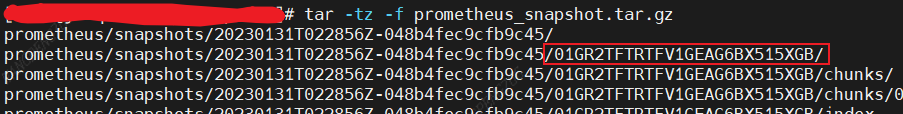

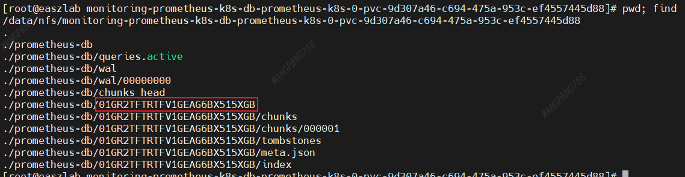

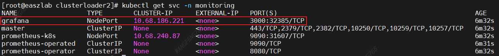

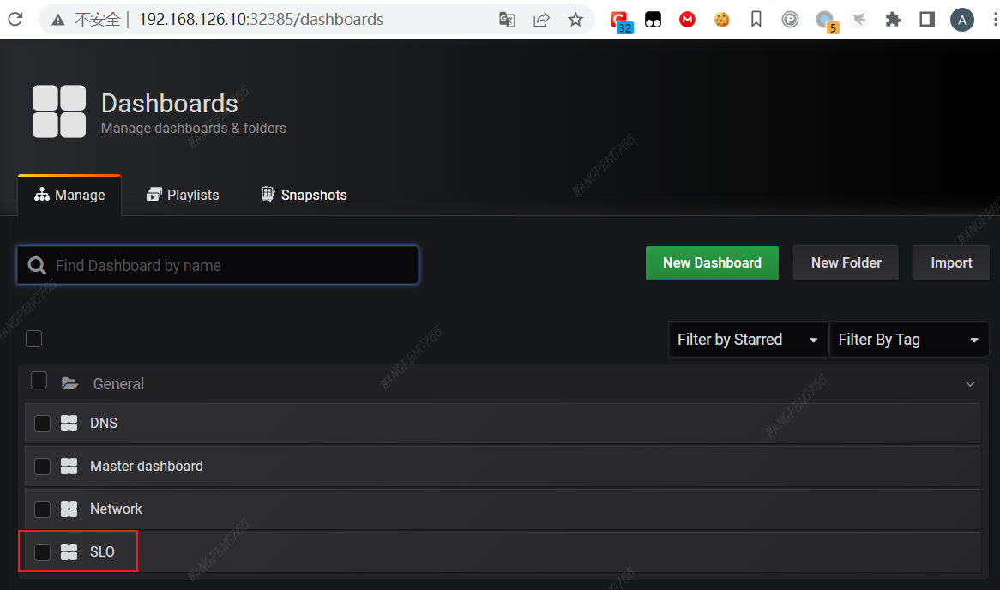

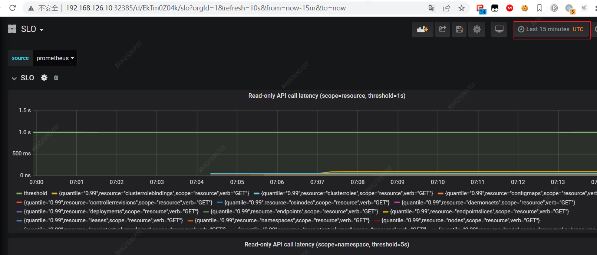

### netperfbenchmark（使用 [netperf](#netperf) 替代）

> 测试结果不如 netperf 详细，并且 HTTP、UDP 测试用例有问题，使用 [netperf](#netperf) 替代

clusterloader2/testing/network/config.yaml

```bash
CL2_PROTOCOL=TCP CL2_NUMBER_OF_SERVERS=1 CL2_NUMBER_OF_CLIENTS=1 \
./clusterloader --kubeconfig=/root/.kube/config \
--provider=local --provider-configs=ROOT_KUBECONFIG=/root/.kube/config \
--v=4 \
--testconfig=testing/network/config.yaml \
--report-dir=./reports --alsologtostderr \
2>&1 \
| tee ./reports/clusterload.log
```

测试过程中出现无法访问自定义资源的问题

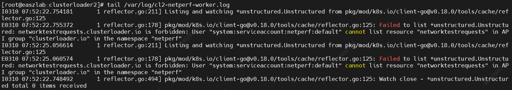

排查后发现是因为使用了低版本 k8s client

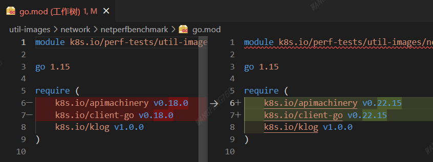

同时修改 `pkg/measurement/common/network/manifests/worker-deployment.yaml`，添加 Pod 反亲和

> worker pod 出现在同一个 node 上会有问题

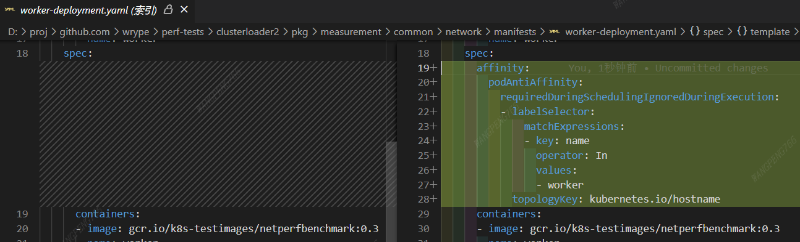

修改后测试通过

```
I0311 17:34:23.904442   21459 simple_test_executor.go:149] Step "[step: 02] Gather network performance measurement" started
I0311 17:34:49.905844   21459 reflector.go:225] Stopping reflector *unstructured.Unstructured (0s) from pkg/mod/k8s.io/client-go@v0.22.15/tools/cache/reflector.go:167
I0311 17:35:04.926752   21459 network_performance_measurement.go:363] Metric value: 266968
I0311 17:35:04.926771   21459 network_performance_measurement.go:413] TestResultSummary: &{   [{map[Value:266968] kbytes/sec map[Metric:Throughput]}]}
I0311 17:35:04.926937   21459 simple_test_executor.go:171] Step "[step: 02] Gather network performance measurement" ended
```

## netperf

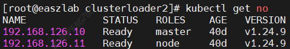

`network/benchmarks/netperf` 目录下编译二进制文件，测试时最少要有 2 个 node 节点

```bash
./netperf --image wrype/netperf-latest:git.4fb93f2 -v 4 --testFrom 0 --testTo 23 | tee netperf.log
```

`--testFrom`、`--testTo` 用于指定测试用例，测试用例如下（nptest.go:170，从 0 开始计数）：

1. Label: "1 qperf TCP. Same VM using Pod IP"
2. Label: "2 qperf TCP. Same VM using Virtual IP"
3. Label: "3 qperf TCP. Remote VM using Pod IP"
4. Label: "4 qperf TCP. Remote VM using Virtual IP"
5. Label: "5 qperf TCP. Hairpin Pod to own Virtual IP"
6. Label: "1 iperf TCP. Same VM using Pod IP"
7. Label: "2 iperf TCP. Same VM using Virtual IP"
8. Label: "3 iperf TCP. Remote VM using Pod IP"
9. Label: "4 iperf TCP. Remote VM using Virtual IP"
10. Label: "5 iperf TCP. Hairpin Pod to own Virtual IP"
11. Label: "6 iperf SCTP. Same VM using Pod IP"
12. Label: "7 iperf SCTP. Same VM using Virtual IP"
13. Label: "8 iperf SCTP. Remote VM using Pod IP"
14. Label: "9 iperf SCTP. Remote VM using Virtual IP"
15. Label: "10 iperf SCTP. Hairpin Pod to own Virtual IP"
16. Label: "11 iperf UDP. Same VM using Pod IP"
17. Label: "12 iperf UDP. Same VM using Virtual IP"
18. Label: "13 iperf UDP. Remote VM using Pod IP"
19. Label: "14 iperf UDP. Remote VM using Virtual IP"
20. Label: "15 netperf. Same VM using Pod IP"
21. Label: "16 netperf. Same VM using Virtual IP"
22. Label: "17 netperf. Remote VM using Pod IP"
23. Label: "18 netperf. Remote VM using Virtual IP"

一段时间后会在 `results_netperf-latest` 目录下生成一个 csv 文件

运行下面的命令生成图表：

```bash
docker run -it --rm -v `pwd`/results_netperf-latest:/plotdata girishkalele/netperf-plotperf --csv /plotdata/netperf-latest_XXX.csv --suffix XXX
```

### 测试用例 1~5（绘制失败）

[netperf-latest_20230217092346.csv](testdata/netperf-latest_20230217092346.csv)

### 测试用例 6~10

[netperf-latest_20230217084729.csv](testdata/netperf-latest_20230217084729.csv)

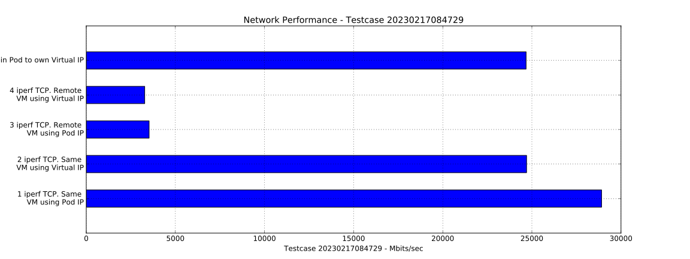

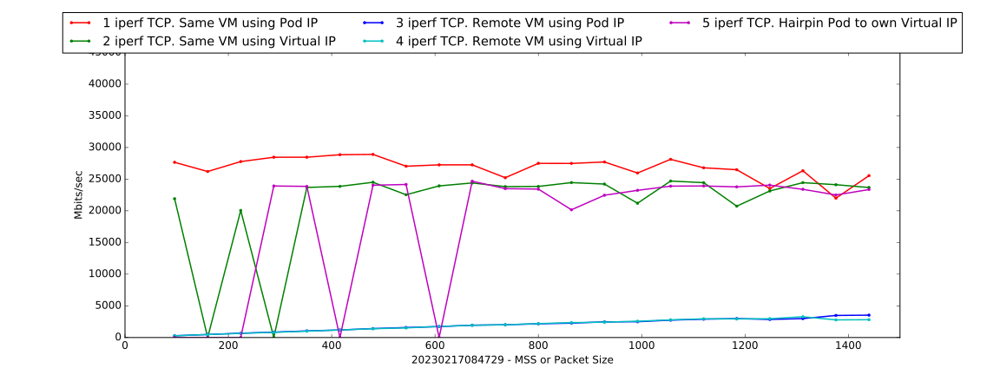

### 测试用例 16~19

[netperf-latest_20230219021543.csv](testdata/netperf-latest_20230219021543.csv)

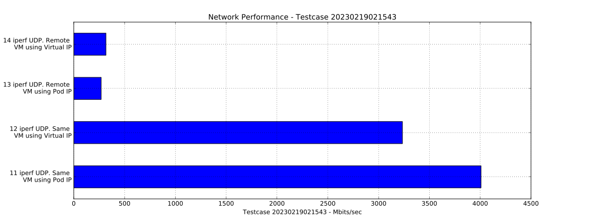

### 测试用例 20~23

[netperf-latest_20230219023853.csv](testdata/netperf-latest_20230219023853.csv)

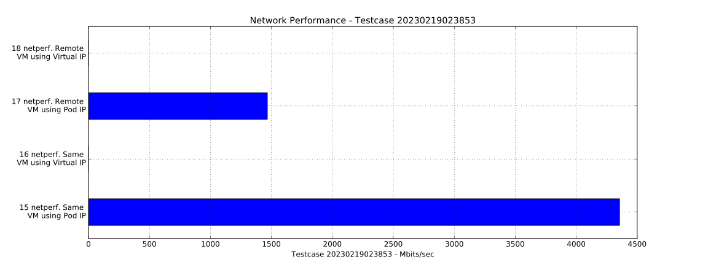

## load

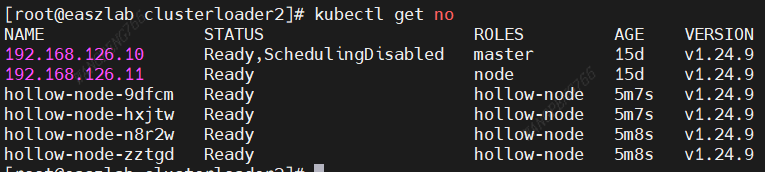

```bash
GCE_SSH_KEY=id_rsa CL2_PROMETHEUS_NODE_SELECTOR='kubernetes.io/role: node' CL2_LOAD_STS_STORAGE_CLASS='managed-nfs-storage' \
./clusterloader --kubeconfig=/root/.kube/config \
--provider=kubemark --provider-configs=ROOT_KUBECONFIG=/root/.kube/config \
--v=4 \
--testconfig=testing/load/config.yaml \
--testoverrides=testing/experiments/enable_restart_count_check.yaml \
--testoverrides=testing/experiments/use_simple_latency_query.yaml \
--testoverrides=testing/overrides/load_throughput.yaml \
--report-dir=./reports \
--alsologtostderr \
--enable-prometheus-server=true \
--tear-down-prometheus-server=false \
--prometheus-manifest-path `pwd`/pkg/prometheus/manifests \
--prometheus-pvc-storage-class managed-nfs-storage \
--prometheus-apiserver-scrape-port 6443 \
--experimental-prometheus-snapshot-to-report-dir \
2>&1 \
| tee ./reports/clusterload.log
```

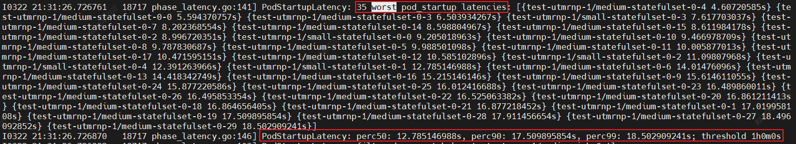

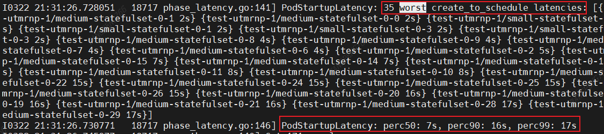

### dnsperf


```bash
GCE_SSH_KEY=id_rsa CL2_PROMETHEUS_NODE_SELECTOR='kubernetes.io/role: node' CL2_LOAD_STS_STORAGE_CLASS='managed-nfs-storage' \
CL2_USE_ADVANCED_DNSTEST=true \
./clusterloader --kubeconfig=/root/.kube/config \
--provider=local --provider-configs=ROOT_KUBECONFIG=/root/.kube/config \
--v=4 \
--testconfig=testing/load/config.yaml \
--testoverrides=testing/prometheus/not-scrape-kube-proxy.yaml \
--report-dir=./reports \
--alsologtostderr \
--enable-prometheus-server=true \
--tear-down-prometheus-server=false \
--prometheus-manifest-path `pwd`/pkg/prometheus/manifests \
--prometheus-pvc-storage-class managed-nfs-storage \
--prometheus-apiserver-scrape-port 6443 \
--experimental-prometheus-snapshot-to-report-dir \
2>&1 \
| tee ./reports/clusterload.log
```

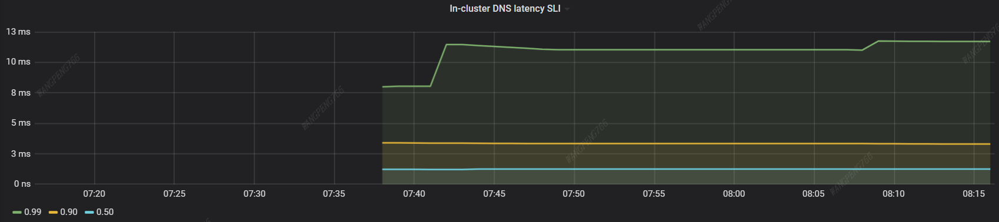

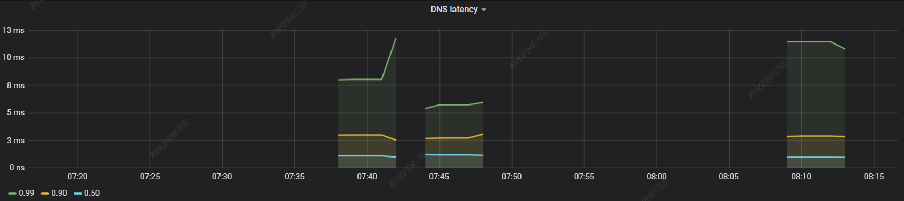

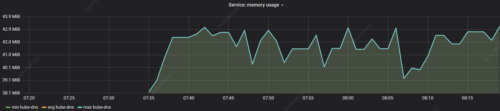

## 附录

### kubemark 镜像列表

- wrype/kubemark:v1.24.9
- wrype/node-problem-detector:v0.8.9
- busybox:1.32

### clusterloader 镜像列表

- quay.io/prometheus-operator/prometheus-config-reloader:v0.46.0
- quay.io/prometheus-operator/prometheus-operator:v0.46.0
- grafana/grafana:6.2.0
- quay.io/prometheus/prometheus:v2.25.0
- wrype/kube-state-metrics:v2.0.0-rc.0
  > tag to registry.k8s.io/kube-state-metrics/kube-state-metrics:v2.0.0-rc.0
- opsdockerimage/e2e-test-images-resource-consumer:1.9
- quay.io/prometheus/node-exporter:v1.0.1
- prom/pushgateway:v1.4.2
- opsdockerimage/e2e-test-images-agnhost:2.32
  > tag to registry.k8s.io/e2e-test-images/agnhost:2.32，无法修改为其他镜像
- wrype/dnsperfgo:v1.3.0
- wrype/k8s-testimages-probes:v0.0.5

### netperf 镜像列表

- wrype/netperf-latest:git.4fb93f2

### 参考文档

http://bingerambo.com/posts/2020/12/k8s%E9%9B%86%E7%BE%A4%E6%80%A7%E8%83%BD%E6%B5%8B%E8%AF%95-kubemark/

http://bingerambo.com/posts/2020/12/k8s%E9%9B%86%E7%BE%A4%E6%80%A7%E8%83%BD%E6%B5%8B%E8%AF%95-clusterloader/

https://raw.githubusercontent.com/kubernetes/test-infra/master/config/jobs/kubernetes/sig-scalability/sig-scalability-periodic-jobs.yaml
