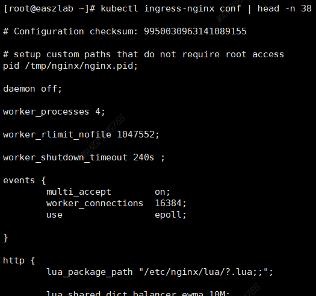

# 前置要求

**需要重新生产`easzlab/kubeasz`镜像，参考 [修改说明.md](../../guide/../setup/修改说明.md)**

部署好 k8s 集群，并部署好 cluster-addon 中的 nfs-provisioner、prometheus

> 未初始化 k8s 集群，可以修改 example/config.yml；已经存在 k8s 集群，修改 cluster/\<cluster name\>/config.yml

> 需要部署这个分支的 prometheus，修改了 serviceMonitor、podMonitor 自动发现的 label，安装后无需再配置 prometheus

**roles/cluster-addon/templates/prometheus/values.yaml.j2**

```yaml
...
    serviceMonitorSelector:
      matchLabels:
        app.kubernetes.io/managed-by: Helm

    podMonitorSelector:
      matchLabels:
        app.kubernetes.io/managed-by: Helm
...
```

安装过程：

```bash
dk bash
cd /etc/kubeasz
./middleware.sh <cluster> [ansible-playbook args]
```

| `config.yml` 相关中间件安装开关 |                                         |
| ------------------------------- | --------------------------------------- |
| middleware_redis_install        |                                         |
| middleware_zk_install           |                                         |
| middleware_ingress_install      |                                         |
| middleware_ingress_example_prom | 创建 ingress 示例 (Prometheus、Grafana) |

# [redis operator](https://ot-redis-operator.netlify.app/docs/)

相关的配置项参考 **example/config.yml** 中的 **middleware_redis\***

## 配置 Grafana 面板

Grafana 导入这个文件 [redis-operator-cluster.json](redis-operator-cluster.json)

> 源文件 https://github.com/OT-CONTAINER-KIT/redis-operator/blob/master/dashboards/redis-operator-cluster.json ，做了部分修改适配


下面是配置好 Grafana 面板后的效果：


## （可选）手动修改 prometheus 采集配置 scrape_configs


```bash
kubectl edit secrets prometheus-kube-prometheus-prometheus-scrape-confg -n monitor
```

> `additional-scrape-configs.yaml` 字段 base64 解码后修改


修改退出后等待一段时间配置会自动生效，配置可以通过 web 查看


# [zookeeper](https://github.com/apache/pulsar-helm-chart)

apache 最新版的 zookeeper 集成在 pulsar 中，这里配置 pulsar 的 helm chart 仅部署 zookeeper

这里 zookeeper 默认部署3个副本，对于 node 节点不足3个的情况，需要关闭反亲和性

> 相关的配置项参考 **example/config.yml** 中的 **middleware_zk\***

**roles/middleware/templates/pulsar-values-cs-3.0.0.yaml.j2**

```yaml
...
zookeeper:
  affinity:
    anti_affinity: false
...
```


Grafana 导入这个文件 [zookeeper.json](zookeeper.json)

> 源文件 https://github.com/apache/pulsar/blob/master/grafana/dashboards/zookeeper.json ，做了部分修改适配


# [ingress-nginx](https://kubernetes.github.io/ingress-nginx/)

相关的配置项参考 **example/config.yml** 中的 **middleware_ingress\***

使用官方最新 1.5.1 版本，版本兼容参考： https://github.com/kubernetes/ingress-nginx#supported-versions-table

> 默认的镜像仓库 `registry.k8s.io` 无法访问，镜像已经手动上传到阿里云，国内可以直接拉取

**roles/middleware/templates/ingress-nginx-values-4.4.0.yaml.j2**

```yaml
...
  image:
    registry: registry.cn-hangzhou.aliyuncs.com
    image: wrype/controller
...
```


## Grafana 导入官方的 dashboard

> https://github.com/kubernetes/ingress-nginx/blob/main/deploy/grafana/dashboards/nginx.json


> https://github.com/kubernetes/ingress-nginx/blob/main/deploy/grafana/dashboards/request-handling-performance.json


## ingress-prom.yml 示例

可以通过 grafana.k8s.lab、prometheus.k8s.lab 这2个域名访问集群内的 Grafana、Prometheus 前端

Windows 需要在 hosts 文件中添加2条记录

```
192.168.126.5 grafana.k8s.lab
192.168.126.5 prometheus.k8s.lab
```


## [（可选）kubectl ingress-nginx 插件](https://kubernetes.github.io/ingress-nginx/kubectl-plugin/)

> 需要 git，联网安装

### 查看上游服务 `kubectl ingress-nginx backends`


### 查看 nginx 配置 `kubectl ingress-nginx conf`



### 查看 controller 日志 `kubectl ingress-nginx logs`

