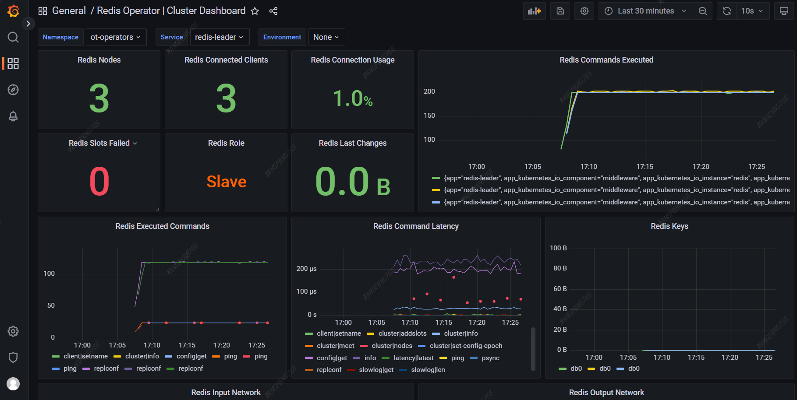

# [redis operator](https://ot-redis-operator.netlify.app/docs/)

前置要求：部署好 k8s 集群，并部署好 cluster-addon 中的 nfs-provisioner、prometheus

> 需要部署这个分支的 prometheus，在采集配置中添加了 redis-exporter，安装后无需再配置 prometheus

**roles/cluster-addon/templates/prometheus/values.yaml.j2**

```yaml
...
    additionalScrapeConfigs: 
    - job_name: 'redis_exporter'
...
```

安装过程：

```bash
dk bash
cd /etc/kubeasz
./middleware.sh <cluster> [ansible-playbook args]
```

## 配置 Grafana 面板

> Grafana 导入这个文件 [redis-operator-cluster.json](redis-operator-cluster.json)


下面是配置好 Grafana 面板后的效果：



### （可选）手动修改 prometheus 采集配置 scrape_configs


```bash
kubectl edit secrets prometheus-kube-prometheus-prometheus-scrape-confg -n monitor
```

> `additional-scrape-configs.yaml` 字段 base64 解码后修改


修改退出后等待一段时间配置会自动生效，配置可以通过 web 查看

