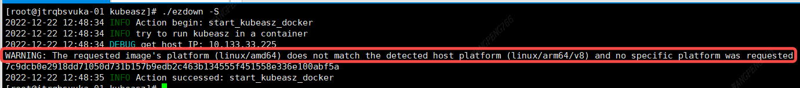

### ezdown -> download_docker

`nslookup download.docker.com` 可以看到有做 cdn，直接从官网下载即可

### `easzlab/kubeasz`镜像

由于`ezdown`中会通过镜像把脚本复制到`/etc/kubeasz`下面

```bash
ezdown
...
function get_kubeasz() {
  ...
  docker cp "temp_easz:$BASE" "$BASE" && \
  ...
}
...
```

使用这个分支时需要重新生成`easzlab/kubeasz`镜像，另外修改脚本后也需要重新生成镜像

```bash
# 修改脚本后要更改 KUBEASZ_VER 版本，并重新生成镜像
export KUBEASZ_VER=3.5.0-aarch64-1.24
sed -i "s/^KUBEASZ_VER=.*$/KUBEASZ_VER=${KUBEASZ_VER}/g" ezdown
docker build -t easzlab/kubeasz:${KUBEASZ_VER} .
```

初次部署可以运行`sudo ./ezdown -D`初始化docker环境，出错后构建好`easzlab/kubeasz`镜像再继续执行

想安装原版`kubeasz`可以运行`./ezdown -D -z <release ver>`

### 通过 `-a` 选项指定对应的架构

`./ezdown -D -a aarch64` 和 `./ezdown -P -a aarch64` 可以离线拉取 aarch64 架构的离线安装包和镜像



在目标机器出现以上错误是因为 kubeasz 镜像依旧是 amd64 架构的，需要在 `/etc/kubeasz` 重新构建镜像，然后导出替换掉 `/etc/kubeasz/down/kubeasz_XXX.tar`